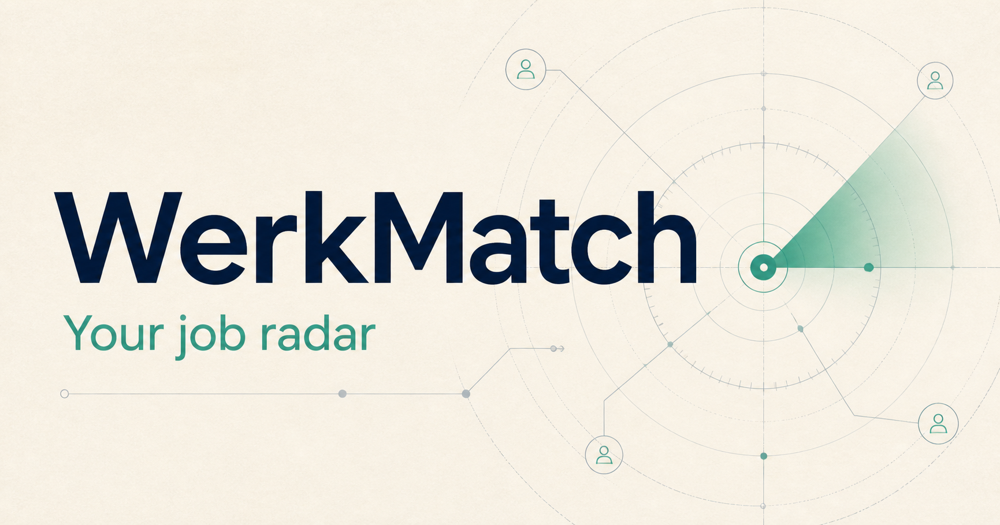
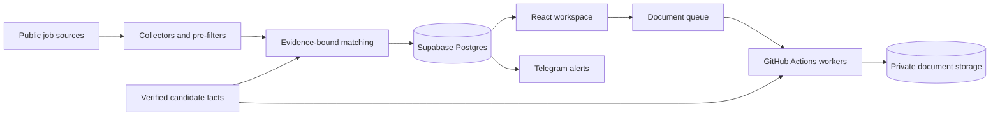

# WerkMatch

**A multi-user job-search workspace that turns verified CV evidence into ranked opportunities and tailored application documents.**

[Live website](https://werkmatch-orcin.vercel.app) · [Interactive demo](https://werkmatch-orcin.vercel.app/demo)



WerkMatch automates the repetitive parts of a technical working-student job search while keeping the candidate in control. It collects roles from public sources, filters them before using AI, scores each job against confirmed CV facts, explains the evidence behind the score, and creates tailored application documents only when requested.

The public demo uses fictional data and requires no account. Private workspaces are invite-only and isolate every user's profile, documents, matches, preferences, notifications, and applications.

## What this project demonstrates

- **Evidence-bound AI:** every match explanation and generated document must reference facts the candidate reviewed and confirmed. Unsupported claims are rejected.
- **Multi-user security:** Supabase row-level security and user-scoped storage paths prevent one account from reading another account's records or files.
- **Resilient automation:** scheduled collectors preserve partial results, respect rate limits and runtime budgets, and recover interrupted document jobs.
- **Human-controlled workflow:** searches may run automatically, but document generation and application tracking require explicit user actions.
- **Production safeguards:** invite-only provisioning, atomic usage limits, private object storage, untrusted LaTeX compilation, bounded concurrency, and input validation.

## Product flow

1. **Onboard:** upload LaTeX CV and cover-letter templates, review extracted facts, and confirm study and availability statements.
2. **Discover:** collect technical working-student roles from structured feeds and public career pages.
3. **Filter:** reject irrelevant roles and ineligible locations before spending an AI request.
4. **Evaluate:** compare job requirements with verified candidate evidence and store a structured score, strengths, gaps, and language risk.
5. **Act:** request a tailored CV and German cover letter, then track the application through its outcome.

## Architecture



| Area                    | Implementation                                                             |
| ----------------------- | -------------------------------------------------------------------------- |
| Web application         | TypeScript, Next.js 16, React 19, Tailwind CSS, Vercel Functions           |
| Identity and data       | Supabase Auth, Postgres, row-level security, private Storage buckets       |
| Matching and generation | Structured OpenCode Go responses validated with Zod                        |
| Job collection          | Arbeitnow plus public Personio, SmartRecruiters, Lever, and LinkedIn pages |
| Background work         | Scheduled GitHub Actions, claim-safe queues, retry and stale-job recovery  |
| Documents               | Template-preserving LaTeX rendering and Tectonic compilation               |
| Notifications           | Account-specific Telegram Bot API alerts                                   |

## Engineering decisions

### Match before generating

WerkMatch uses deterministic filters for role type and location before asking the model to evaluate a job. AI receives only the job listing, user preferences, and verified candidate facts. The response must match a strict schema, and every evidence identifier must resolve to an allowed fact.

### Keep the CV authoritative

The uploaded CV remains the source of truth. Tailoring may reorder recognizable skill entries and local bullet points to emphasize relevance, but it cannot rewrite factual content or change the document's section structure. Cover letters preserve the user's template, sender, layout, closing, and signature while replacing job-specific fields and an evidence-backed body.

Each cover letter explains the candidate's fit and contribution, connects relevant skills to a named verified project and certification, describes concrete professional experience, and includes the confirmed availability statement. The worker rejects a compiled cover letter unless the PDF is exactly one A4 page.

### Design for interrupted workers

Document requests move through explicit queue states. Workers reclaim stale work, atomically claim one request, reuse validated tailoring plans after compilation failures, and never publish incomplete output as ready. Collection jobs retain results completed before a runtime deadline instead of discarding the entire run.

### Isolate accounts at multiple layers

Authorization is enforced in server routes, database policies, compound ownership constraints, storage paths, and worker queries. Daily budgets are updated atomically in Postgres so concurrent requests cannot bypass limits. New schedules and notifications default to disabled.

## Verification

The automated suite covers source parsing, job identity and deduplication, filtering, matching and document contracts, retry behavior, queue dispatch, template rendering, and account ownership helpers.

An opt-in integration test uses temporary accounts and fictional documents against the live Supabase project. It verifies onboarding, AI fact extraction, invitation acceptance, database and storage isolation, concurrent quotas, protected routes, and cleanup of its test data.

```powershell
npx tsc --noEmit
npm run lint
node --test tests/*.test.ts
```

## Run locally

Requirements: Node.js 22.13 or newer, a Supabase project, and credentials for the configured matching service.

```powershell
Copy-Item .env.example .env.local
npm install
npx supabase db push --linked
npm run dev
```

After applying the migrations, create an invite-only account with:

```powershell
node --env-file=.env.local scripts/create-invite.ts person@example.com
```

The command prints a one-time setup link; it does not send email. The recipient sets a password and completes onboarding in the browser.

## Current scope

- Technical Werkstudent and Working Student roles in Bavaria, plus confirmed Germany-wide remote roles
- Self-contained UTF-8 LaTeX CV and cover-letter templates up to 200 KB each
- German application letters with user-confirmed study and availability statements
- Public-source collection only; no authenticated LinkedIn crawling or personal session cookies
- Daily limits of 6 searches, 8 document requests, and 3 profile extractions per account

PDF and Word template import are not included in the current release.

## Repository safety

Local environment files, CVs, portraits, generated documents, deployment metadata, and agent/tooling folders are excluded from version control. Never commit credentials, candidate documents, Telegram identifiers, or one-time invitation links.
